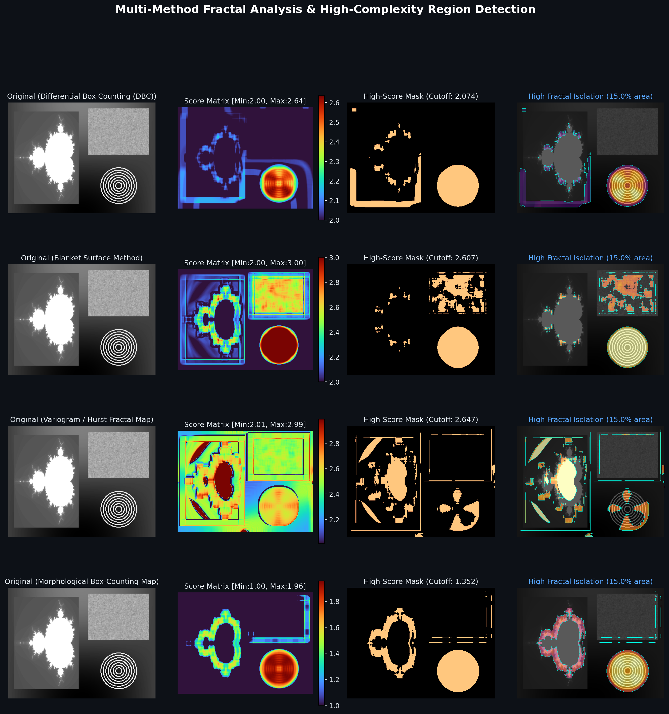
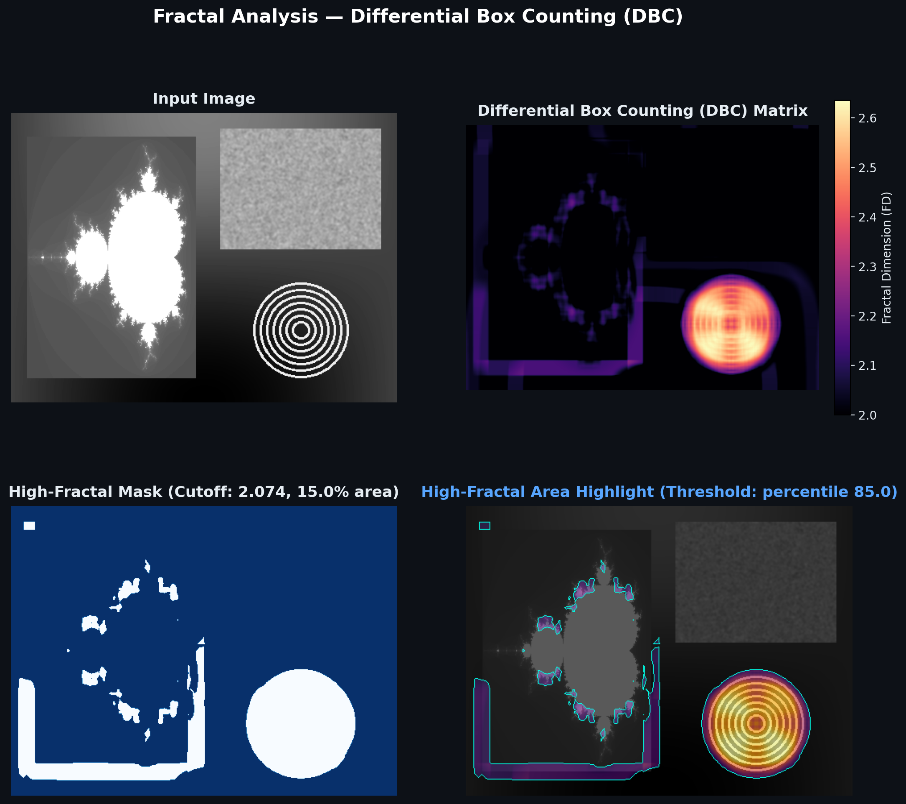
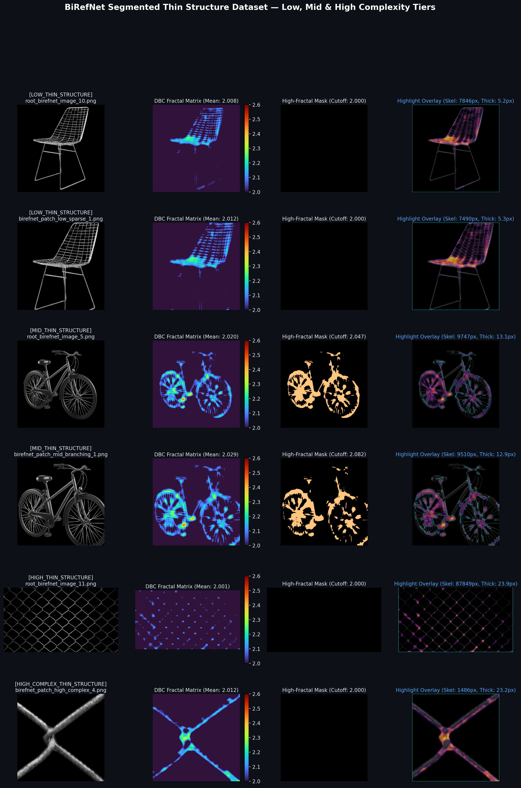

# 2D Image Fractal Analysis & Thin Structure Complexity Mapping

A lightweight Python tool for computing local fractal dimension maps across 2D images, extracting numerical fractal score matrices, and identifying regions of high structural complexity (e.g., micro-vessels, cracks, dendritic branches, fiber networks).

---

## Method Comparison

Below is a comparison of all four methods applied to the same test image containing smooth gradients, textured noise, and fractal boundary patterns:



Each row illustrates:
1. **Input Image**: The original grayscale/RGB image.
2. **Fractal Score Matrix (Heatmap)**: Pixel-by-pixel local fractal dimension values.
3. **High-Fractal Mask**: Binary mask isolating regions above a given percentile or cutoff.
4. **Highlight Overlay**: The detected high-complexity zones highlighted directly over the original image.

---

## Methods Overview

A 2D grayscale image can be viewed either as a 3D topographic surface $(x, y, I(x,y))$ or as a set of boundary curves and edges. Different methods measure different aspects of surface roughness and structural density:

| Method | Theoretical Range | Best Suited For | Key Intuition |
| :--- | :---: | :--- | :--- |
| **Differential Box Counting (DBC)** | $2.0 \le FD \le 3.0$ | Surface roughness & texture variation | Treats pixel intensities as columns in 3D space. Counts how many boxes of scale $s$ are needed to cover the intensity spread $max - min$. |
| **Blanket Method (Peleg)** | $2.0 \le FD \le 3.0$ | Multi-scale morphological thickness | Expands upper (dilation) and lower (erosion) surfaces by thickness $\epsilon$. Measures how total surface area decays across scales. |
| **Variogram / Hurst Exponent** | $2.0 \le FD \le 3.0$ | Texture correlation & directional persistence | Fits the structure function $E[(I(x+r) - I(x))^2] \propto r^{2H}$. Relates Hurst parameter $H$ to fractal dimension ($FD = 3 - H$). |
| **Morphological Box Counting** | $1.0 \le FD \le 2.0$ | Segmented thin lines, cracks, & vessel trees | Focuses strictly on edge/skeleton geometry. Measures how many 2D boxes cover the binary skeleton across different box sizes. |

### 1. Differential Box Counting (DBC)
Based on Sarkar & Chaudhuri (1994). The local neighborhood is covered with $s \times s$ grid columns. If the intensity values within column $(i, j)$ range from $m$ to $M$, the number of boxes of height $s'$ required to cover this column is:

$$n_s(i, j) = \left\lceil \frac{M}{s'} \right\rceil - \left\lceil \frac{m}{s'} \right\rceil + 1$$

Summing $n_s$ over the local window across multiple box sizes $s \in \{3, 5, 7, 9, 13\}$ yields the box count $N(s)$. The slope of $\log(N(s))$ against $\log(1/s)$ gives the local fractal dimension.

### 2. Blanket Method
Based on Peleg et al. (1984). The surface is enveloped by two blankets:
- Upper surface: $u_\epsilon(x, y) = \max(u_{\epsilon-1}(x,y) + 1, \max_{\text{neighbors}} u_{\epsilon-1})$
- Lower surface: $b_\epsilon(x, y) = \min(b_{\epsilon-1}(x,y) - 1, \min_{\text{neighbors}} b_{\epsilon-1})$

The volume between blankets is $V(\epsilon) = \sum (u_\epsilon - b_\epsilon)$, and the surface area is $A(\epsilon) = (V(\epsilon) - V(\epsilon-1)) / 2$. Fitting $\log(A(\epsilon))$ vs $\log(\epsilon)$ gives slope $2 - FD$.

### 3. Variogram / Hurst Exponent (fBm)
Assumes the local texture follows fractional Brownian motion. The variance of intensity increments at lag $r$ scales as $E[(\Delta I_r)^2] \propto r^{2H}$. Rough surfaces have low $H$ (close to 0), yielding high fractal dimensions ($FD = 3 - H \to 3.0$). Smooth surfaces have $H \to 1.0$, yielding $FD \to 2.0$.

### 4. Morphological Box Counting
Evaluates binary edges and line networks. The edges are iteratively dilated with square kernels of size $s$. The active area fraction divided by $s^2$ estimates non-overlapping box coverage. The log-log slope gives the 1D-to-2D geometric boundary dimension ($1.0 \le FD \le 2.0$).

---

## Detailed Single-Method Analysis

Here is a 4-panel breakdown generated by the tool using Differential Box Counting:



1. **Top-Left**: Original input image.
2. **Top-Right**: 2D fractal score matrix heatmap with numerical scale.
3. **Bottom-Left**: Binary threshold mask showing the high-score pixels.
4. **Bottom-Right**: Composite overlay (dimmed background + thermal heatmap on high-score areas + cyan contour boundary).

---

## Project Structure

```text
Fractal_analysis/
├── assets/                          # Images and visual figures for documentation
│   ├── comparison_dashboard.png
│   ├── dbc_analysis.png
│   └── dataset_overview.png
├── dataset/                         # Categorized thin-structure images
│   ├── low_thin_structure/         # Sparse filaments, isolated single branches
│   ├── mid_thin_structure/         # Branching vascular trees and networks
│   ├── high_complex_thin_structure/# Dense multi-scale capillary/fiber networks
│   ├── dataset_catalog.csv         # Full metadata with quantified FD scores
│   └── dataset_catalog.json        # JSON format catalog
├── fractal_analyzer.py              # Core calculation engine & CLI tool
├── build_birefnet_dataset.py        # Pipeline to assemble and catalog dataset
├── demo_run.py                      # Quick test run script
├── requirements.txt                 # Python dependencies
├── .gitignore
└── README.md
```

---

## Dataset: Thin Structure Complexity Tiers

The dataset contains segmented thin-structure images (transparent background with foreground structures) organized into three complexity tiers:



- **Low Complexity**: Simple isolated filaments, linear cracks, and sparse branch endpoints (low skeleton length, $FD_{DBC} \approx 2.00 - 2.01$).
- **Mid Complexity**: Moderately branching trees, retinal vessel paths, and leaf venation ($FD_{DBC} \approx 2.01 - 2.03$).
- **High Complexity**: Dense, interconnected multi-scale micro-vascular beds and cellular networks ($FD_{DBC} \ge 2.03$, higher edge/skeleton density).

All samples are cataloged with their physical metrics (thickness, skeleton length, active ratio) in [`dataset/dataset_catalog.csv`](dataset/dataset_catalog.csv).

---

## Installation

```bash
git clone https://github.com/<your-username>/Fractal_analysis.git
cd Fractal_analysis
pip install -r requirements.txt
```

---

## Quick Start

### 1. Run via CLI

Run analysis on any image:
```bash
python fractal_analyzer.py --image "path/to/image.png" --method all --threshold-type percentile --threshold-val 85 --output-dir ./results
```

Run on the built-in synthetic benchmark:
```bash
python fractal_analyzer.py --demo --threshold-val 90 --export-format csv
```

#### CLI Parameters:
- `--image`: Path to input image.
- `--demo`: Use built-in multi-region benchmark image.
- `--method`: `dbc`, `blanket`, `variogram`, `morphological`, or `all` (default: `all`).
- `--window-size`: Sliding window size in pixels (default: `21`).
- `--threshold-type`: `percentile`, `absolute`, or `otsu` (default: `percentile`).
- `--threshold-val`: Cutoff (e.g. `85.0` for top 15%, or `2.2` for absolute FD).
- `--export-format`: `npy` or `csv` (default: `npy`).
- `--output-dir`: Output folder for matrices and figures (default: `./fractal_output`).

### 2. Python API

```python
from fractal_analyzer import FractalAnalyzer, visualize_single_method

# Initialize
analyzer = FractalAnalyzer(window_size=21)
analyzer.load_image("my_sample.png")

# Compute 2D score matrix
dbc_matrix = analyzer.compute_map('dbc')
print("Matrix shape:", dbc_matrix.shape)
print(f"Fractal dimension range: [{dbc_matrix.min():.3f}, {dbc_matrix.max():.3f}]")

# Threshold high-score regions (e.g. top 10%)
mask, cutoff, stats = analyzer.threshold_map('dbc', threshold_type='percentile', threshold_value=90.0)
print(f"High-fractal cutoff score: {cutoff:.3f}")
print(f"Area covered: {stats['high_area_percentage']:.2f}%")

# Export matrix to CSV or NPY
analyzer.export_matrix('dbc', 'dbc_scores.csv', format='csv')

# Save 4-panel visual dashboard
visualize_single_method(analyzer, method='dbc', threshold_value=90.0, save_path='dbc_output.png')
```

---

## License

MIT License. Open for research and commercial use.
